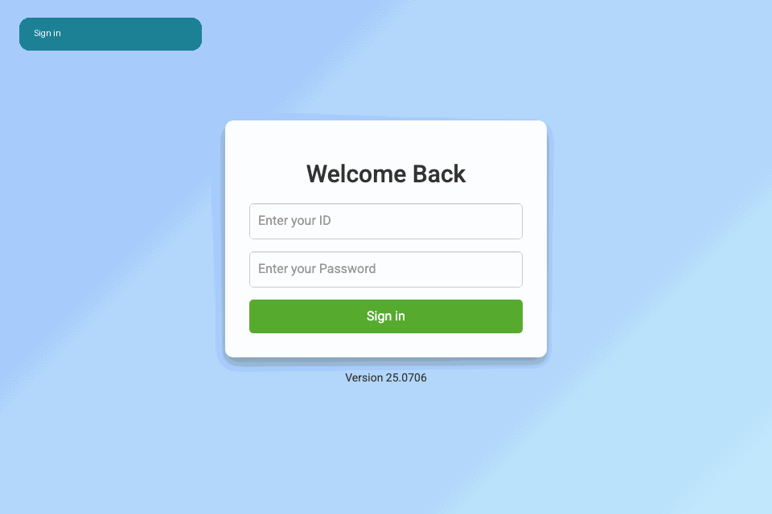
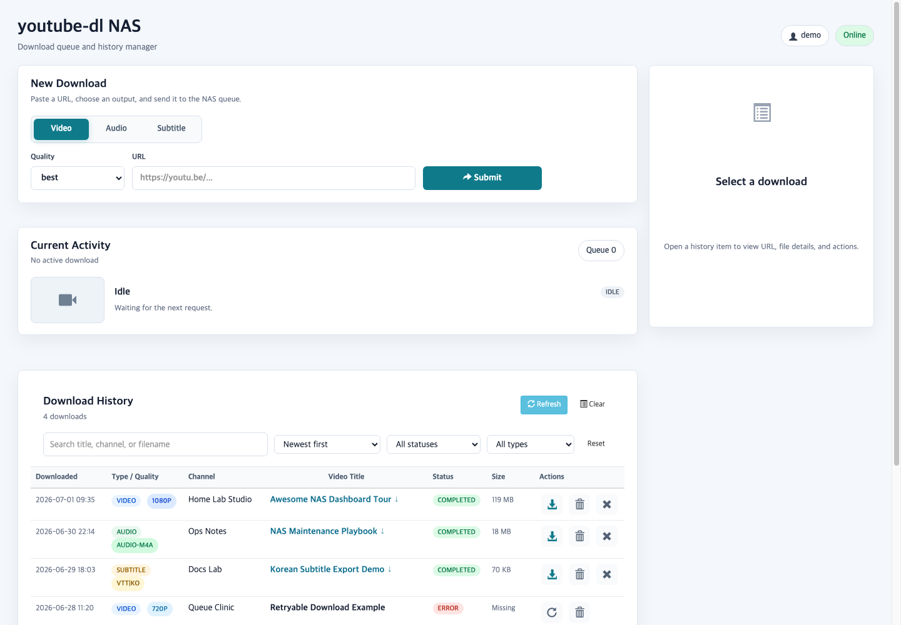
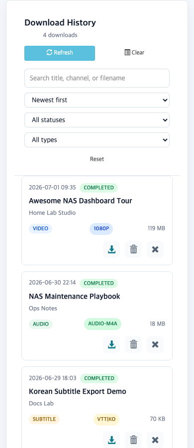
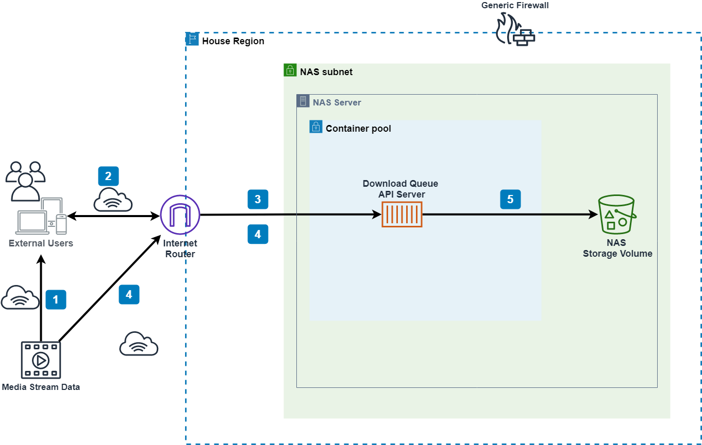
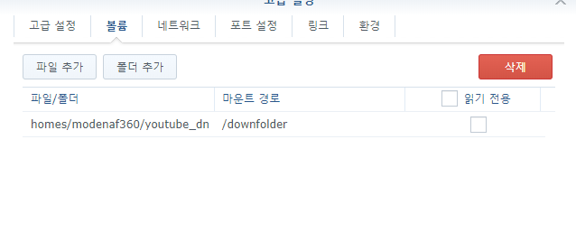
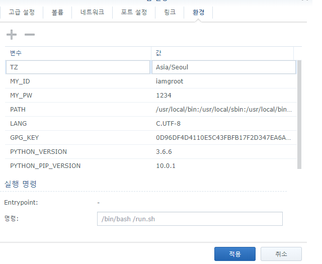

# youtube-dl-nas

[](LICENSE)
[](https://hub.docker.com/r/modenaf360/youtube-dl-nas/)
[](https://hub.docker.com/r/modenaf360/youtube-dl-nas/)
[](https://github.com/hyeonsangjeon/youtube-dl-nas/actions/workflows/docker.yml)

`youtube-dl-nas` is a small NAS-friendly download queue for videos, audio, and subtitles. It wraps `yt-dlp` with an authenticated web dashboard, real-time progress updates, download history, file actions, and a REST API for automation.



Docker Hub: <https://hub.docker.com/r/modenaf360/youtube-dl-nas/>

## Highlights

- Queue video, audio, or subtitle downloads from a browser.
- Track current activity with queue count, progress, title, channel, and thumbnail.
- Review download history and mounted folder files with search, filters, sorting, mobile cards, and a detail drawer.
- Retry failed items, download saved files, delete history rows, or delete physical files.
- Keep history under `./metadata/download_history.json` for persistence.
- Automate downloads through a simple REST API.
- Run cleanly on NAS or home-server Docker setups.

## Screenshots

<p>
  
  
</p>

## Quick Start

Run the container with a persistent download volume and login credentials:

```shell
docker run -d \
  --name youtube-dl \
  -e MY_ID=modenaf360 \
  -e MY_PW=1234 \
  -v /volume2/youtube-dl:/downfolder \
  -p 8080:8080 \
  modenaf360/youtube-dl-nas
```

Open `http://localhost:8080`, sign in with `MY_ID` / `MY_PW`, accept the Terms of Use on first launch, and submit a URL.

### Time Zone

```shell
docker run -d \
  --name youtube-dl \
  -e TZ=Asia/Seoul \
  -e MY_ID=modenaf360 \
  -e MY_PW=1234 \
  -v /volume2/youtube-dl:/downfolder \
  -p 8080:8080 \
  modenaf360/youtube-dl-nas
```

### Host Network With Custom App Port

```shell
docker run -d \
  --name youtube-dl \
  --net=host \
  -e APP_PORT=9999 \
  -e MY_ID=modenaf360 \
  -e MY_PW=1234 \
  -v /volume2/youtube-dl:/downfolder \
  modenaf360/youtube-dl-nas
```

## Docker Options

| Option | Description |
| --- | --- |
| `-v host:/downfolder` | Required persistent download volume. Keep the guest path as `/downfolder`. |
| `-p host:guest` | Port forwarding. The app defaults to `8080`. |
| `-e MY_ID` | Required login ID. Avoid values starting with `!`, `$`, or `&`. |
| `-e MY_PW` | Required login password. Avoid values starting with `!`, `$`, or `&`. |
| `-e TZ` | Optional container time zone, for example `Asia/Seoul`. |
| `-e APP_PORT` | Optional app port. Defaults to `8080`. |
| `-e PROXY` | Optional proxy value passed to `yt-dlp`. Defaults to empty. |

## REST API

### Queue a Download

```shell
curl -X POST http://localhost:8080/youtube-dl/rest \
  -H 'Content-Type: application/json' \
  -d '{
    "url": "https://www.youtube.com/watch?v=s9mO5q6GiAc",
    "resolution": "best",
    "id": "iamgroot",
    "pw": "1234"
  }'
```

Successful response:

```json
{
  "success": true,
  "msg": "download has started",
  "Remaining downloading count": "7"
}
```

Supported `resolution` examples:

- `best`
- `2160p`, `1440p`, `1080p`, `720p`, `480p`, `360p`, `240p`, `144p`
- `audio-m4a`, `audio-mp3`
- `vtt|en`, `vtt|ko`, `srt|en`, `srt|ko`

### Authenticated Dashboard APIs

These endpoints are used by the web UI and require a valid login cookie:

| Endpoint | Method | Purpose |
| --- | --- | --- |
| `/youtube-dl/status` | `GET` | Read current active download, queue count, and connected clients. |
| `/youtube-dl/history` | `GET` | Read normalized download history plus mounted `/downfolder` files that are not in metadata yet. |
| `/youtube-dl/history/retry/<uuid>` | `POST` | Queue a previous history item again. |
| `/youtube-dl/history/delete/<uuid>` | `POST` | Delete the history row only. |
| `/youtube-dl/history/delete-file/<uuid>` | `POST` | Delete the physical file and related history rows. |
| `/youtube-dl/history/clear` | `POST` | Clear history rows while keeping downloaded files. |

## Local Development

Install dependencies:

```shell
pip install -r requirements.txt
```

Prepare `Auth.json` with local credentials, then run:

```shell
python youtube-dl-server.py
```

The app reads `APP_PORT` from `Auth.json`; the default is typically `8080` when substituted by the container entrypoint.

Useful checks before committing:

```shell
python3 -m py_compile youtube-dl-server.py
node --check static/logical_js/logic.js
git diff --check
docker build -t youtube-dl-nas:local .
```

## Container Build And Publishing

Build locally:

```shell
docker build -t youtube-dl-nas:local .
```

Run the local image:

```shell
docker run --rm \
  -e MY_ID=tester \
  -e MY_PW=secret \
  -v "$PWD/downfolder:/downfolder" \
  -p 8080:8080 \
  youtube-dl-nas:local
```

The GitHub Actions workflow builds the Docker image for pull requests and pushes only from the default branch or version tags. Configure these repository secrets before publishing to Docker Hub:

- `DOCKERHUB_USERNAME`
- `DOCKERHUB_TOKEN`

That keeps every Git change build-verified without publishing unreviewed images.

## Architecture

The application is a Python Bottle server running inside a Debian-based Python container. Downloads are queued in-process, processed by a worker thread, and written to `/downfolder`.

- Web server: [`bottle`](https://github.com/bottlepy/bottle)
- WebSocket: [`bottle-websocket`](https://github.com/zeekay/bottle-websocket)
- Download engine: [`yt-dlp`](https://github.com/yt-dlp/yt-dlp)
- Original queue server base: [`python queue server`](https://github.com/manbearwiz/youtube-dl-server)



## Synology Notes

When using Synology Container Manager or Docker UI, mount a host folder to `/downfolder` and set `MY_ID`, `MY_PW`, and optional environment variables in the container settings.

Volume setup:



ID and password setup:



## Legal Disclaimer

This tool is based on `yt-dlp` and is provided solely for personal and legitimate use in accordance with applicable laws. Users are responsible for complying with copyright laws. Downloading or distributing copyrighted material without permission from the rightsholder may violate applicable laws.

This project does not encourage or support unauthorized use. The developer bears no legal responsibility for unauthorized or illegal use by users.

## Release Notes

Full release history lives in [CHANGELOG.md](CHANGELOG.md).
