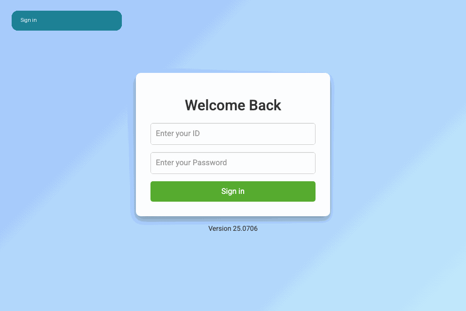
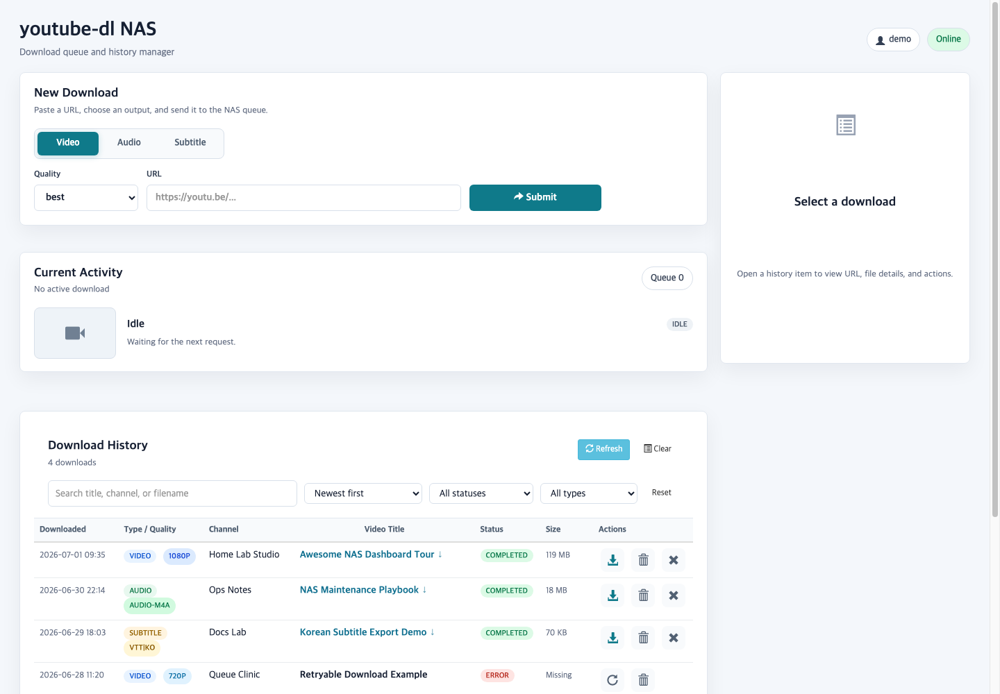
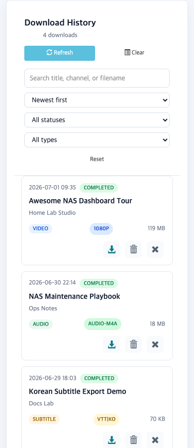
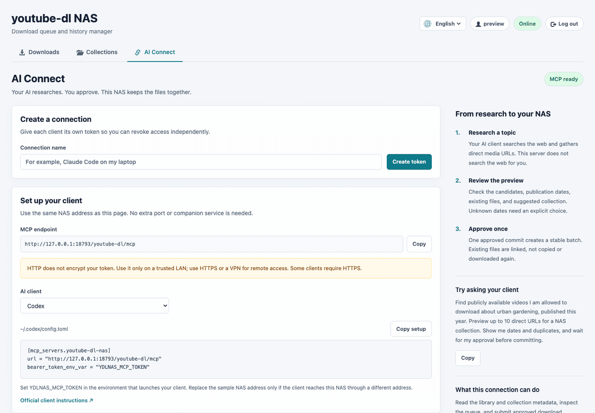
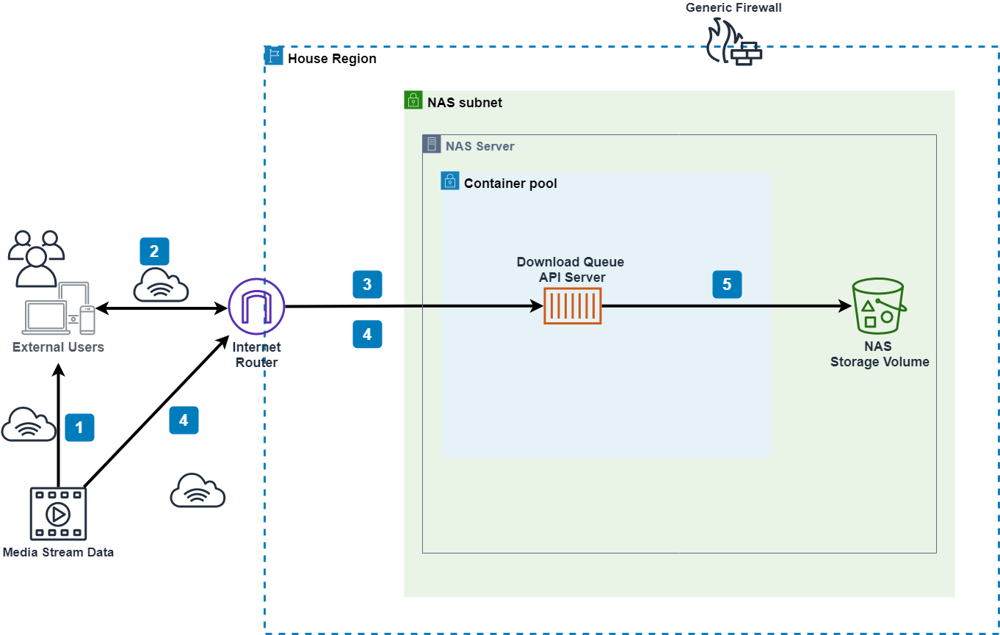
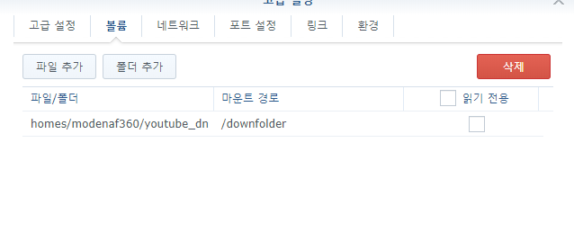
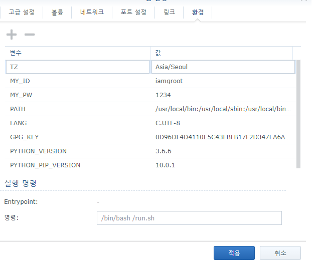

# youtube-dl-nas

[](https://awesome-selfhosted.net/tags/media-management.html)
[](LICENSE)
[](https://github.com/hyeonsangjeon/youtube-dl-nas/actions/workflows/ci.yml)
[](https://github.com/hyeonsangjeon/youtube-dl-nas/actions/workflows/docker.yml)
[](https://github.com/hyeonsangjeon/youtube-dl-nas/releases/latest)
[](https://hub.docker.com/r/modenaf360/youtube-dl-nas/)
[](https://hub.docker.com/r/modenaf360/youtube-dl-nas/)

`youtube-dl-nas` is a small NAS-friendly download queue for videos, audio, and subtitles. It wraps `yt-dlp` with an authenticated web dashboard, real-time progress updates, download history, file actions, and a REST API for automation.



Docker Hub: <https://hub.docker.com/r/modenaf360/youtube-dl-nas/>

Current release: `26.0906` (`2026-09-06`)

## Start Here

| Goal | Go to |
| --- | --- |
| Install the app for the first time | [Docker Compose Quick Start](#quick-start) |
| Choose a NAS or Docker deployment path | [Deployment paths](examples/) |
| Upgrade an existing container or diagnose a problem | [Operations guide](https://hyeonsangjeon.github.io/youtube-dl-nas/operations/) |
| Send links from Android, iPhone, or iPad | [Mobile sharing guide](https://hyeonsangjeon.github.io/youtube-dl-nas/mobile/) |
| Organize researched URLs and connect an AI client | [MCP Collections guide](docs/mcp/) |
| Review the newest changes | [Latest release](https://github.com/hyeonsangjeon/youtube-dl-nas/releases/latest) |
| Report a reproducible problem | [Issue form](https://github.com/hyeonsangjeon/youtube-dl-nas/issues/new/choose) |

> **Need automatic full-channel backups instead?** `youtube-dl-nas` remains the
> small URL download queue. For scheduled channel backups, existing
> `archive.txt` and NAS-folder import, missing-only downloads, and disk-first
> recovery, see [Channel Vault NAS](https://github.com/hyeonsangjeon/channel-vault-nas).

| Choose | Best fit |
| --- | --- |
| **youtube-dl-nas** | Paste individual video/playlist URLs into a compact authenticated queue |
| **[Channel Vault NAS](https://github.com/hyeonsangjeon/channel-vault-nas)** | Register channels once and keep only missing/new videos backed up automatically |

## Highlights

- Queue video, audio, or subtitle downloads from a browser.
- Choose an explicit Compatible MP4 profile when a client requires H.264 video and AAC audio; existing Best and resolution profiles keep their current behavior.
- Keep the last successfully queued dashboard profile ready on each device without auto-submitting the next URL.
- Use the login, terms, and dashboard flows in English, Korean, Simplified Chinese, or Polish, with browser-language detection and a saved language preference.
- Keep the lightweight queue safe across container restarts with JSON state, partial-download continuation, duplicate guards, and removable waiting jobs.
- Submit once and let Smart Preflight inspect metadata and existing NAS files during a three-second undo window before transfer starts.
- Share a URL from an installed Android PWA, configurable Android HTTP Shortcut, or signed Smart Share v2 iOS Shortcut without a relay service.
- Guard playlist and channel URLs with explicit Current video, First 10, or All items scope before they reach the queue.
- Optionally save a JPG thumbnail beside each downloaded video or audio file.
- Track current activity with ordered queued jobs, progress, transfer speed, ETA, title, channel, and thumbnail.
- See free download-volume capacity, stop an active job without deleting compatible partial data, and get a concrete recovery action when a download fails.
- Review download history and mounted folder files in compact list or thumbnail grid views with search, filters, newest-first sorting, and 20-item numbered pages, then open Library Overview for stored totals, recent activity, media mix, and recorded failures.
- Surface pre-existing files in `/downfolder` even when they do not have saved download metadata.
- Preview saved video and audio in the dashboard, retry failed items, download files, delete history rows, or delete physical files.
- Compare SRT, VTT, ASS, and SSA files with a verified transcript using `nlptutti` character/word error metrics and keyword preservation checks.
- Persist the queue, history, terms acceptance, and the signed-session secret under `./metadata`.
- Automate downloads through a simple REST API.
- Keep `yt-dlp` current at startup and every hour by default without stopping the app when an update check fails.
- Install or upgrade `nlptutti` when each new container starts so Subtitle QA uses the current package release.
- Include Deno and the matching `yt-dlp-ejs` components required for current YouTube JavaScript challenges.
- Run cleanly on NAS or home-server Docker setups.

## Screenshots

<p>
  
  
</p>

## Languages

The web app supports English, Korean (`ko-KR`), Simplified Chinese (`zh-CN`), and Polish (`pl-PL`). It uses the first supported browser language on a new device, falls back to English, and remembers an explicit selection for one year. The language selector is available before sign-in and from the authenticated dashboard.

## Dashboard Workflow

1. Paste a URL, choose Video, Audio, or Subtitle mode, then submit it to the queue. Playlist and channel URLs open a scope selector before bulk work can start.
2. Watch Current Activity check the source and count down to an automatic start. Use the remove control during this three-second Smart Preflight window to undo the request without adding a history row.
   Once transfer starts, the control changes to Stop and retains compatible partial data for retry. Existing media is not downloaded twice: an **Already on NAS** receipt links directly to preview, file download, and details. Jobs restored after a container restart remain labeled in the queue.
3. Use Files & History to switch between compact list and thumbnail grid views. The default sort is newest downloaded first.
4. Search with the `Search` button or Enter, then move through results with 20-item page buttons.
5. Preview video or audio directly, or select an item to open its source URL, metadata state, file details, and actions.
6. For a subtitle file, select **Subtitle QA**, paste a verified reference transcript, optionally add comma-separated keywords, and run the comparison.

Open **Options** to save thumbnail sidecars, choose the profile used when this device shares a URL to the installed PWA, or manage a bounded Netscape cookies file for restricted sources. **Compatible MP4** requests H.264/AAC without silently falling back to another codec; **Ask every time** returns the shared URL to the composer instead of queueing it immediately. The share setting is stored in a signed, HTTP-only preference cookie on that device.

Playlist Guard defaults a normal video URL containing a playlist parameter to **Current video only**. Pure playlist and channel URLs require an explicit **First 10** or **All items** choice. Every completed output receives its own Files & History row.

### Collections And AI Connect

Release `26.0906` adds **Downloads**, **Collections**, and **AI Connect** to the
same authenticated dashboard. Existing download and metadata volumes remain
compatible; keep both mounted when upgrading.

Open **Collections → Collect URLs** to preview a bounded set of direct media
URLs, optionally filter by publication date, and approve the selected items
once. Known out-of-range items cannot be included; unknown dates require an
explicit selection. Previews expire after 30 minutes. Repeating an approved
commit returns the same batch rather than queueing it twice.

New collection downloads go under
`/downfolder/collections/<immutable-slug--short-id>/`. Existing files stay where
they are and can be linked to several collections without copying. Collections
show their purpose, date policy, folder, stored size, batch progress, and missing
files. Renaming or removing a collection changes only organization metadata.
Clearing history preserves files, collections, memberships, and batches.

Open **AI Connect** to create a named connection, copy its one-time token, and
select client setup instructions. The MCP endpoint is
`https://YOUR_NAS/youtube-dl/mcp`, on the same address and port as the dashboard.
The normal image includes the official Python MCP SDK and an nginx front end;
there is no extra container, published port, or MCP feature flag.

The AI client searches the web and proposes URLs; the NAS validates candidates,
checks duplicates, and queues approved work. MCP exposes no file-deletion tool
or arbitrary filesystem path. Use HTTPS or a VPN for remote access.
See the [MCP setup, API, and release-gate guide](docs/mcp/) for client-specific
configuration and the distinction between protocol coverage and native-client QA.



The short demonstration uses labelled synthetic local media, not real web
research or a claim of native-client verification.

### Subtitle QA

Subtitle QA reads the selected subtitle file directly from `/downfolder` and compares its spoken text with the reference transcript you provide. The result includes character accuracy (CRR), character error rate (CER), word error rate (WER), edit counts, and optional keyword preservation. Lower CER/WER and higher character accuracy are better.

The feature supports downloaded or mounted `.srt`, `.vtt`, `.ass`, and `.ssa` files. Reference text is processed only inside your NAS container and is not sent to an external service.

### Mounted Files And Metadata

Files already present in `/downfolder`, including safe nested paths, are scanned into Files & History even if they were not downloaded by this app version. Those rows show `Mounted folder` and `No metadata` because source URL, channel, and quality details are not available.

Clearing history rows does not delete files. Kept files are reloaded from `/downfolder` and shown again as mounted files. Use the file delete action only when you want to remove the physical file.

### Safe Queue And Restart Recovery

The active request and waiting jobs are written atomically to `queue_state.json` in the metadata volume. After a container restart, the interrupted active request is restored first, followed by the remaining queue in its original order. `yt-dlp --continue` reuses compatible partial files from `/downfolder/.incomplete`; whether a remote source can resume the exact byte range depends on that source.

Equivalent URLs with share-tracking parameters removed are not queued twice with the same download profile and options. After metadata extraction, the stable extractor and media ID provide a second duplicate check against files already on the NAS. A repeated completion for the same physical file reuses its existing history row and original download timestamp. Failed and canceled history items remain retryable. Safe failure categories appear only in item details; private URLs, credentials, cookie contents, and mounted paths are not persisted as diagnostics. Send `"force": true` through the REST API only when overwriting an existing download is intentional.

When a request becomes active, Smart Preflight starts metadata inspection and a three-second minimum start window at the same time. A slow metadata response does not add another three-second delay. Undo during this phase removes the request without creating a canceled history row. If the extracted media identity matches an existing file, transfer is skipped and the dashboard keeps an actionable receipt for one minute. When metadata cannot be read, the dashboard shows a warning and still lets `yt-dlp` attempt the requested download.

The dashboard warns when the download volume has 10 GiB or less free and pauses new queue additions at 2 GiB or less by default. Existing and active jobs are not deleted. Adjust these thresholds with `YDLNAS_STORAGE_WARNING_GB` and `YDLNAS_STORAGE_CRITICAL_GB`, or set either value to `0` to disable that threshold.

Mount `/usr/src/app/metadata` persistently to retain the safe queue across container replacement. The queue remains intentionally file-backed and does not require a database.

## Quick Start

Docker Compose is the recommended installation because it preserves both downloads and application state:

```shell
cp .env.example .env
docker compose up -d
```

Edit `.env` before starting and set at least `MY_ID` and `MY_PW`. Downloads are stored in `./downloads`; queue state, history, terms acceptance, and the session secret are stored in `./config`.

The equivalent `docker run` command is:

```shell
docker run -d \
  --name youtube-dl-nas \
  --restart unless-stopped \
  -e MY_ID=nas-user \
  -e MY_PW=change-this-password \
  -v /volume2/youtube-dl:/downfolder \
  -v /volume2/docker/youtube-dl-nas:/usr/src/app/metadata \
  -p 8080:8080 \
  modenaf360/youtube-dl-nas
```

Open `http://localhost:8080`, sign in with `MY_ID` / `MY_PW`, accept the Terms of Use on first launch, and submit a URL.

### Time Zone

```shell
docker run -d \
  --name youtube-dl-nas \
  --restart unless-stopped \
  -e TZ=Asia/Seoul \
  -e MY_ID=nas-user \
  -e MY_PW=change-this-password \
  -v /volume2/youtube-dl:/downfolder \
  -v /volume2/docker/youtube-dl-nas:/usr/src/app/metadata \
  -p 8080:8080 \
  modenaf360/youtube-dl-nas
```

### Host Network With Custom App Port

```shell
docker run -d \
  --name youtube-dl-nas \
  --restart unless-stopped \
  --net=host \
  -e APP_PORT=9999 \
  -e MY_ID=nas-user \
  -e MY_PW=change-this-password \
  -v /volume2/youtube-dl:/downfolder \
  -v /volume2/docker/youtube-dl-nas:/usr/src/app/metadata \
  modenaf360/youtube-dl-nas
```

## Docker Options

| Option | Description |
| --- | --- |
| `-v host:/downfolder` | Required persistent download volume. Keep the guest path as `/downfolder`. |
| `-v host:/usr/src/app/metadata` | Recommended persistent state volume for the restart-safe queue, history, terms acceptance, and signed sessions. |
| `-p host:guest` | Port forwarding. The app defaults to `8080`. |
| `-e MY_ID` | Required login ID. Avoid values starting with `!`, `$`, or `&`. |
| `-e MY_PW` | Required login password. Avoid values starting with `!`, `$`, or `&`. |
| `-e MY_ID_FILE` | Advanced alternative: read the login ID from one mounted secret file. `MY_ID` wins when both are set. |
| `-e MY_PW_FILE` | Advanced alternative: read the login password from one mounted secret file. `MY_PW` wins when both are set. |
| `-e TZ` | Optional container time zone, for example `Asia/Seoul`. |
| `-e APP_PORT` | Optional app port. Defaults to `8080`. |
| `-e PROXY` | Optional proxy value passed to `yt-dlp`. Defaults to empty. |
| `-e PUID`, `-e PGID` | Optional numeric owner for new download and state files. Defaults to `0`. |
| `-e UMASK` | Optional file creation mask. Defaults to `022`. |
| `-e YTDLP_AUTO_UPDATE` | Keep the startup and scheduled `yt-dlp` updater enabled. Defaults to `true`. |
| `-e YTDLP_UPDATE_INTERVAL` | Updater interval in seconds. Defaults to `3600`, with a minimum of `300`. |
| `-e NLPTUTTI_AUTO_UPDATE` | Install or upgrade `nlptutti` once whenever a new container starts. Defaults to `true`. |
| `-e NLPTUTTI_UPDATE_TIMEOUT` | Maximum runtime package-update duration in seconds. Defaults to `180`. |
| `-e YTDLP_COOKIES_FILE` | Optional path to a mounted Netscape-format cookies file. |
| `-e YTDLP_EXTRA_ARGS` | Optional administrator-controlled extra arguments parsed with shell-style quoting. |
| `-e YDLNAS_ALLOW_PRIVATE_SOURCES` | Advanced opt-in for downloads from private or local network addresses. Defaults to `false`. |
| `-e YDLNAS_STORAGE_WARNING_GB` | Free-space warning threshold in GiB. Defaults to `10`; set `0` to disable. |
| `-e YDLNAS_STORAGE_CRITICAL_GB` | Free-space threshold that pauses new queue additions. Defaults to `2`; set `0` to disable. |
| `-e YDLNAS_MCP_BATCH_LIMIT` | Maximum candidates per MCP or dashboard collection preview. Defaults to `25`, clamped to `1`–`100`. |
| `-e YDLNAS_API_TOKEN` | Optional Bearer token for integrations. Normal ID/password API authentication remains available. |
| `-e YDLNAS_API_TOKEN_FILE` | Advanced alternative: read the optional Bearer token from one mounted secret file. The direct variable wins when both are set. |
| `-e COOKIE_SECURE` | Set to `true` when the dashboard is served exclusively over HTTPS. |

### Docker Compose Secrets

Environment variables remain the simplest choice for Synology and other NAS interfaces. Advanced Compose deployments can mount one secret per file and point the matching `_FILE` variable at `/run/secrets/...`:

```yaml
services:
  youtube-dl-nas:
    environment:
      MY_ID_FILE: /run/secrets/ydlnas_id
      MY_PW_FILE: /run/secrets/ydlnas_password
      YDLNAS_API_TOKEN_FILE: /run/secrets/ydlnas_api_token
    secrets:
      - ydlnas_id
      - ydlnas_password
      - ydlnas_api_token

secrets:
  ydlnas_id:
    file: ./secrets/id.txt
  ydlnas_password:
    file: ./secrets/password.txt
  ydlnas_api_token:
    file: ./secrets/api-token.txt
```

Leave the corresponding direct variable empty when using its file form. A non-empty direct variable always takes precedence. Startup stops with a concise error when a requested file is missing, unreadable, not a regular file, or empty; secret values are never printed.

### Cookies For Restricted Sources

Signed-in administrators can open dashboard **Options** to upload, replace, or remove an app-managed Netscape cookies file. The file is limited to 1 MiB, validated before replacement, stored as `0600` in the persistent metadata volume, and never returned by the API or printed in diagnostics. Cookies can grant account access, so export them only for sites and accounts you are authorized to use.

`YTDLP_COOKIES_FILE` remains supported for an externally mounted file. When it is set, the dashboard reports only whether that file is readable and treats it as read-only; the external setting takes precedence over the app-managed file.

## Mobile Sharing

- Android over HTTPS: install the dashboard as a PWA, choose a **Mobile share default** under **Options**, then select **youtube-dl NAS** from the Android share sheet.
- Android over local HTTP: import the provided HTTP Shortcuts template, run **1. Configure NAS** once, and enter the normal dashboard URL, ID, password, and default profile.
- iPhone/iPad: install the signed [Download to NAS Shortcut](docs/mobile/assets/Download-to-NAS.shortcut) and answer its one-time NAS URL, login, and default-profile questions. No action editing is required.

See the [mobile sharing guide](https://hyeonsangjeon.github.io/youtube-dl-nas/mobile/) or the source in [`docs/mobile`](docs/mobile/). No relay server is used; the phone sends URLs directly to the NAS. GitHub Pages only hosts the manual and import files.

Immediate mobile profiles keep the one-share workflow: the NAS queues the URL, runs Smart Preflight, and starts automatically. No second confirmation screen is added. Playlist Guard and **Ask every time** continue to open the composer only when an explicit choice is required.

## REST API

### Queue a Download

```shell
curl -X POST http://localhost:8080/youtube-dl/rest \
  -H 'Content-Type: application/json' \
  -d '{
    "url": "https://www.youtube.com/watch?v=s9mO5q6GiAc",
    "resolution": "best",
    "playlist_mode": "single",
    "write_thumbnail": false,
    "id": "iamgroot",
    "pw": "1234"
  }'
```

Successful response:

```json
{
  "success": true,
  "queued": true,
  "duplicate": false,
  "code": "queued",
  "profile": "best",
  "queue_position": 2,
  "queue_count": 2,
  "msg": "Added best to the NAS queue at position 2.",
  "Remaining downloading count": "2"
}
```

The ID/password fields remain the default integration method. When `YDLNAS_API_TOKEN` is configured, advanced clients may omit them and send:

```shell
curl -X POST http://localhost:8080/youtube-dl/rest \
  -H 'Authorization: Bearer your-token' \
  -H 'Content-Type: application/json' \
  -d '{"url":"https://youtu.be/s9mO5q6GiAc","resolution":"best"}'
```

The API returns `"duplicate": true` without adding another job when the same URL, profile, and options are already queued or saved on the NAS. Add `"force": true` only when an intentional repeat download is required.

`playlist_mode` accepts `single`, `first10`, or `all`. It defaults to `single` for normal URLs and video URLs that also contain a playlist parameter. Pure playlist and channel URLs require an explicit value so an unbounded download cannot start accidentally. Set `write_thumbnail` to `true` to save a converted JPG beside each video or audio file.

For a YouTube URL containing `t`, `start`, or `time_continue`, set `section_mode` to `from_timestamp` to download from that shared position; omit it or use `full` for the whole item. Smart mobile clients can authenticate and POST shared text to `/youtube-dl/share/context` first. That endpoint extracts the first URL and reports whether profile, playlist-scope, or timestamp choices are relevant before the final queue request.

Queue receipts and errors retain the English `msg` field for existing integrations and also include stable `code` values. Receipts expose the selected profile and queue position; errors may include interpolation or choice `params`. The dashboard uses those fields to show errors in the selected language.

Supported `resolution` examples:

- `best`
- `compatible-mp4` for H.264 video plus AAC audio in an MP4 container
- `2160p`, `1440p`, `1080p`, `720p`, `480p`, `360p`, `240p`, `144p`
- `audio-m4a`, `audio-mp3`, `audio-opus`
- `vtt|en`, `vtt|ko`, `srt|en`, `srt|ko`

### Authenticated Dashboard APIs

These endpoints are used by the web UI and require a valid login cookie:

| Endpoint | Method | Purpose |
| --- | --- | --- |
| `/youtube-dl/status` | `GET` | Read the active download, live transfer details, ordered queue, connected clients, and safe storage-capacity status. |
| `/youtube-dl/preferences` | `GET`, `POST` | Read or update the signed per-device PWA share profile. |
| `/youtube-dl/q/<job_id>/remove` | `POST` | Remove a waiting job before it becomes active. |
| `/youtube-dl/q/active/cancel` | `POST` | Stop the active job, retain compatible partial data, and continue with the next queued job. |
| `/youtube-dl/history` | `GET` | Read normalized download history plus mounted `/downfolder` files that are not in metadata yet. |
| `/youtube-dl/history/retry/<uuid>` | `POST` | Queue a previous history item again. |
| `/youtube-dl/history/delete/<uuid>` | `POST` | Delete the history row only. |
| `/youtube-dl/history/delete-file/<uuid>` | `POST` | Delete the physical file and related history rows. |
| `/youtube-dl/history/clear` | `POST` | Clear history rows while keeping downloaded files. |
| `/youtube-dl/subtitle-qa/<uuid>` | `POST` | Compare a stored SRT/VTT/ASS/SSA file with a reference transcript using `nlptutti`. |
| `/static/preview/<uuid>` | `GET` | Stream an existing video or audio file inline for the authenticated preview player. |
| `/static/thumbnail/<uuid>` | `GET` | Serve a saved thumbnail sidecar to the authenticated dashboard. |

## Local Development

Install dependencies:

```shell
pip install -r requirements.txt
pip install -r requirements-dev.txt
```

Prepare `Auth.json` with local credentials, then run:

```shell
python youtube-dl-server.py
```

The app reads `APP_PORT` from `Auth.json`; the default is typically `8080` when substituted by the container entrypoint.

Useful checks before committing:

```shell
python3 -m py_compile youtube-dl-server.py
node --check static/logical_js/logic.js
pytest -q
docker compose --env-file .env.example config
git diff --check
docker build -t youtube-dl-nas:local .
```

## Container Build And Publishing

Build locally:

```shell
docker build -t youtube-dl-nas:local .
```

Run the local image:

```shell
docker run --rm \
  -e MY_ID=tester \
  -e MY_PW=secret \
  -v "$PWD/downfolder:/downfolder" \
  -v "$PWD/metadata:/usr/src/app/metadata" \
  -p 8080:8080 \
  youtube-dl-nas:local
```

The GitHub Actions workflow builds and starts the Docker image for pull requests, verifies the live `/health` response and sign-in page, and publishes nothing. A version tag repeats that runtime smoke test before publishing multi-architecture `linux/amd64` and `linux/arm64` images to both Docker Hub (`modenaf360/youtube-dl-nas`) and GHCR (`ghcr.io/hyeonsangjeon/youtube-dl-nas`). One tag build updates `latest`, the pinned release tag, and its immutable `sha-` tag together.

Manual workflow runs default to smoke-only mode. The smoke compares image
size and idle process RSS with the previous release on the same platform;
growth above 100 MB or 75 MB respectively blocks publication for review.
The GitHub release waits for that tag's successful image publication.

Configure these repository secrets before publishing to Docker Hub:

- `DOCKERHUB_USERNAME`
- `DOCKERHUB_TOKEN`

GHCR publishing uses the workflow's built-in `GITHUB_TOKEN`; no additional registry secret is required.

That keeps pull requests build-verified and avoids rebuilding the same release once for the merge and again for the tag.

## Architecture

The application runs inside one Debian-based Python container. nginx owns
the public port and routes browser, REST, WebSocket, and MCP requests to
loopback-only Bottle/gevent and MCP ASGI services. Bottle remains the sole
writer for the single-worker queue and atomic JSON state. Completed files
are written below `/downfolder`, including immutable collection directories.

The supervisor stops the container when a core service or the enabled updater
daemon dies. A fatal worker persistence error makes health unavailable and
terminates the web process so restart recovery uses durable queue state.
Startup package checks may fail without blocking the application; the updater
checks `yt-dlp` and matching EJS components hourly by default and attempts
`nlptutti` installation or upgrade at each container start. Deno supplies the
JavaScript runtime used by current YouTube extraction challenges.

- Web server: [`bottle`](https://github.com/bottlepy/bottle)
- WebSocket: [`bottle-websocket`](https://github.com/zeekay/bottle-websocket)
- Download engine: [`yt-dlp`](https://github.com/yt-dlp/yt-dlp)
- Subtitle quality metrics: [`nlptutti`](https://pypi.org/project/nlptutti/)
- Original queue server base: [`python queue server`](https://github.com/manbearwiz/youtube-dl-server)



## Synology Notes

When using Synology Container Manager or Docker UI, mount a download folder to `/downfolder`, mount a configuration folder to `/usr/src/app/metadata`, and set `MY_ID`, `MY_PW`, and optional environment variables in the container settings. Use `compose.yaml` as a Container Manager project when available.

Volume setup:



ID and password setup:



## Legal Disclaimer

This tool is based on `yt-dlp` and is provided solely for personal and legitimate use in accordance with applicable laws. Users are responsible for complying with copyright laws. Downloading or distributing copyrighted material without permission from the rightsholder may violate applicable laws.

This project does not encourage or support unauthorized use. The developer bears no legal responsibility for unauthorized or illegal use by users.

## Release Notes

Full release history lives in [CHANGELOG.md](CHANGELOG.md).
Focused follow-up work is tracked in the public [youtube-dl-nas Roadmap](https://github.com/users/hyeonsangjeon/projects/2).
